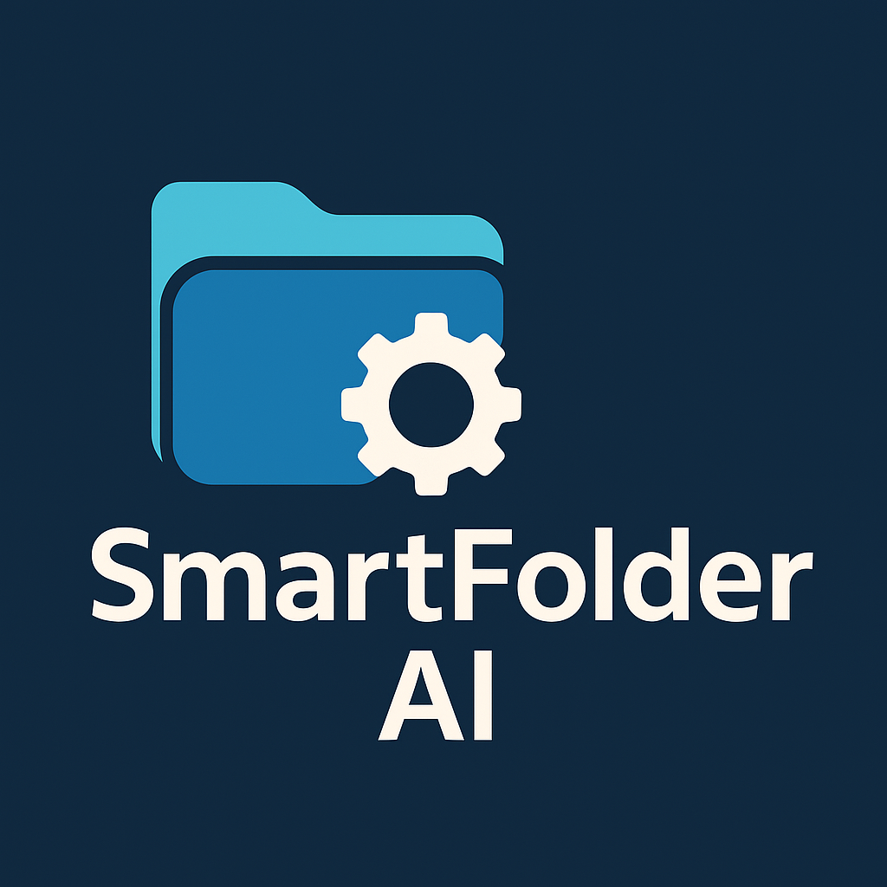
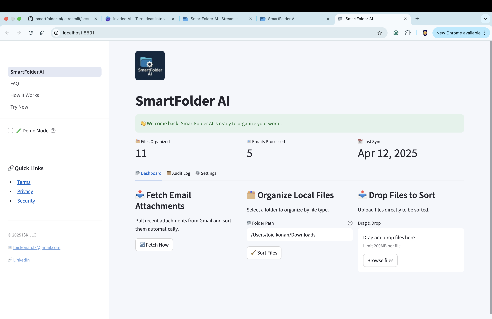
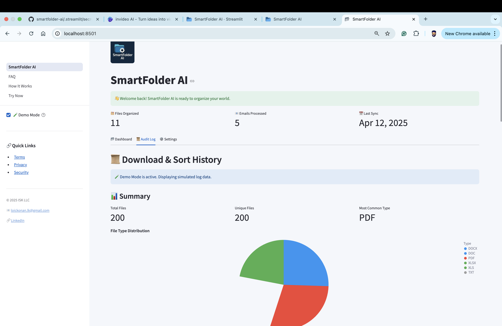
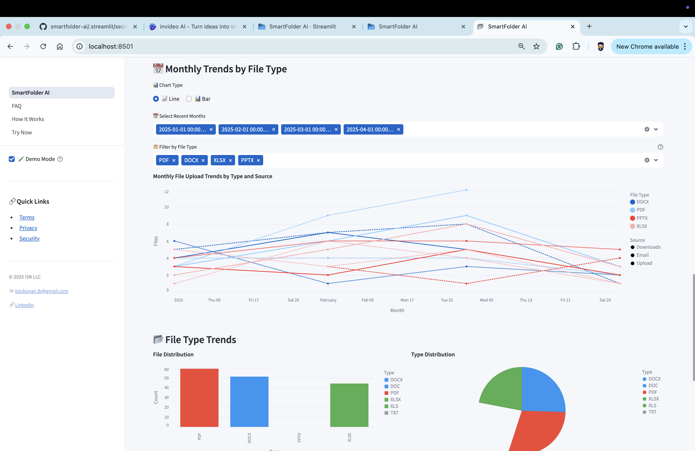
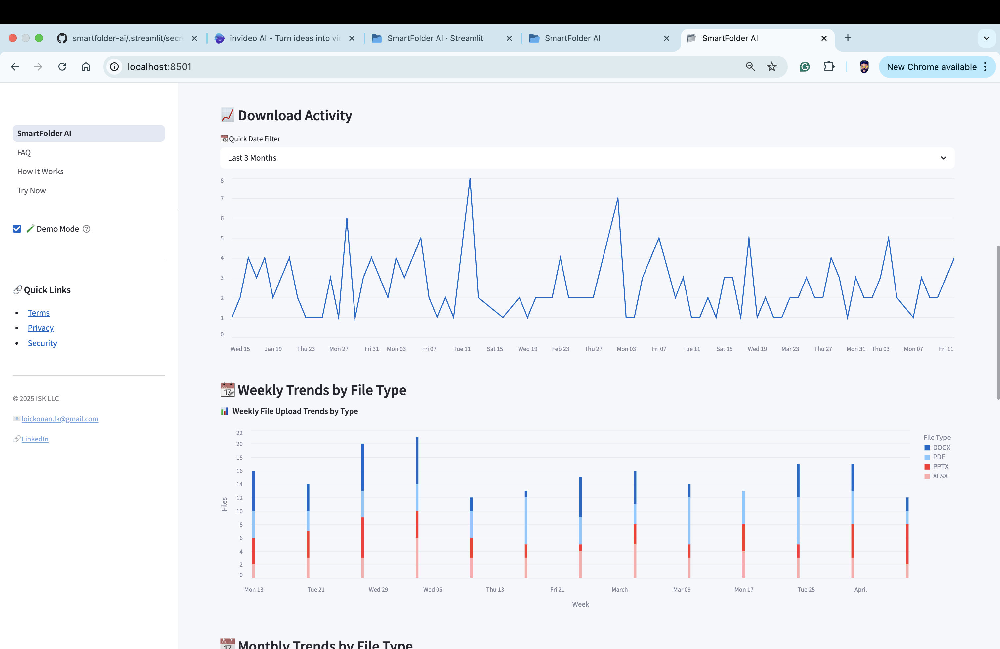

# 📬 SmartFolder AI - Email Document Sorter 📁



[](https://streamlit.io)
[](https://smartfolderai.streamlit.app/)
[](https://www.linkedin.com/in/loickonan/)

## 📌 Overview & Demo

SmartFolder AI is a modern document automation app that connects to your email, fetches attachments, and organizes them into clean, categorized folders — PDFs, WordDocs, Excels, and more. It also logs every action for audit-ready compliance.

Built for regulated industries like healthcare, finance, and government teams.

🎥 **Watch It in Action**  
Learn how SmartFolder AI works in under 2 minutes:

<iframe src="https://www.loom.com/embed/fb644b3271b74bf2b3770eb1732d5ef7?autoplay=1"
        frameborder="0" webkitallowfullscreen mozallowfullscreen allowfullscreen
        style="width:100%;height:400px;"></iframe>


---

## 🔧 Features

✅ Modern web interface with Streamlit  
📧 Connects to your Gmail account  
📎 Downloads and processes email attachments  
📂 Organizes files into categories (PDFs, WordDocs, Excels, PowerPoints)  
🔄 Also organizes existing files in your Downloads folder  
🧠 Prevents duplicate downloads using file hashing  
📊 Interactive dashboard with download history  
⚙️ Easy-to-use settings panel

---

## 📁 File Categories

The application automatically categorizes files into the following folders:

- PDFs
- WordDocs (`.doc`, `.docx`)
- Excels (`.xls`, `.xlsx`)
- PowerPoints (`.ppt`, `.pptx`)
- Others (for any other file types)

---

## 📦 Dependencies

The application requires the following Python packages:

- streamlit (>=1.0.0)
- python-dotenv (>=0.19.0)
- pandas (>=1.3.0)
- streamlit-option-menu (>=0.3.0)

All dependencies are listed in `requirements.txt`. To install them:

```bash
pip install -r requirements.txt
```

---

## ⚙️ Setup Instructions

### 1. 🐍 Install Python (if not already installed)

```bash
python3 --version
```

### 2. 💾 Install Required Packages

```bash
pip install -r requirements.txt
```

### 3. 🔑 Enable IMAP + Get a Gmail App Password

- Visit [https://myaccount.google.com/apppasswords](https://myaccount.google.com/apppasswords)
- Choose "Mail" → "Mac" or create a custom name like "Email Script"
- Copy the 16-character password

### 4. 📝 Create a `.env` File

Place a `.env` file in the same folder as your script:

```
EMAIL_USER=your.email@gmail.com
EMAIL_PASS=your_16_char_app_password
```

### 5. 🚀 Run the Application

```bash
streamlit run SmartFolder_AI.py
```

The application will open in your default web browser at `http://localhost:8501`

---

## 🎯 Using the Application

### Dashboard
- Click "📂 Organize Local Files" to sort existing files in your Downloads folder
- Click "📧 Fetch Email Attachments" to download and organize new email attachments

### History Log
- View a list of all previously downloaded files
- Download the log as a CSV file

### Settings
- Configure application settings (coming soon)

---

## 🏗️ Architecture

The application is built with a modular architecture:

- **UI Layer**: Streamlit-based web interface
- **Email Handler**: IMAP-based email fetching and attachment processing
- **File Manager**: Handles file categorization and organization
- **Logging System**: Tracks downloaded files and prevents duplicates

---

## 🔍 Troubleshooting

### Common Issues

1. **Email Connection Failed**
   - Verify your Gmail credentials in `.env`
   - Ensure IMAP is enabled in your Gmail settings
   - Check your internet connection

2. **File Organization Issues**
   - Verify write permissions in the target directory
   - Check if files are not being used by other applications
   - Ensure sufficient disk space

3. **Application Not Starting**
   - Verify all dependencies are installed
   - Check Python version compatibility
   - Ensure port 8501 is available

---

## 🔐 Security Notes

- Your `.env` file contains sensitive information. **Do not share it.**
- The application stores file hashes locally to prevent duplicates
- All operations are performed on your local machine

---

## 🚀 Deployment Options
```bash
streamlit run SmartFolder_AI.py
```

## 🖥️ Technologies Used

- Python 3.9+
- Streamlit
- IMAP (Gmail)
- Pandas
- Altair for charts
- dotenv for secure config management

## 👤 About the Creator

Created by **Loic Konan** — passionate about automation, compliance, and productivity.

- 💼 [LinkedIn](https://www.linkedin.com/in/loickonan/)
- 📧 loickonan.lk@gmail.com

## 📄 License

This project is licensed under the MIT License. See `LICENSE` for details.

---

## 📈 Performance Considerations

- The application processes files in memory, so large files may impact performance
- Email fetching is limited to the last 24 hours to maintain efficiency
- File hashing is used to prevent duplicate processing
- The application is designed for personal use and may need optimization for larger-scale deployment

## 📸 Screenshots

### 📊 Dashboard View


### 📜 Audit Log & Summary


### 📈 Trends & Activity


### 📊 Monthly + Weekly Analytics


---

## 🤝 Contributing

I welcome contributions! Here's how you can help:

1. Fork the repository
2. Create a feature branch
3. Make your changes
4. Submit a pull request

Please ensure your code:
- Follows PEP 8 style guidelines
- Includes appropriate documentation
- Has been tested thoroughly

---

## 💡 Future Enhancements

- 📅 Advanced email filtering options
- 🤖 AI-powered file categorization
- 📊 Enhanced analytics dashboard
- 🔄 Real-time file monitoring
- 🔍 Advanced search capabilities

---

Built with ❤️ and automation by **Loic Konan**  
🔗 [LinkedIn](https://www.linkedin.com/in/loickonan/)
